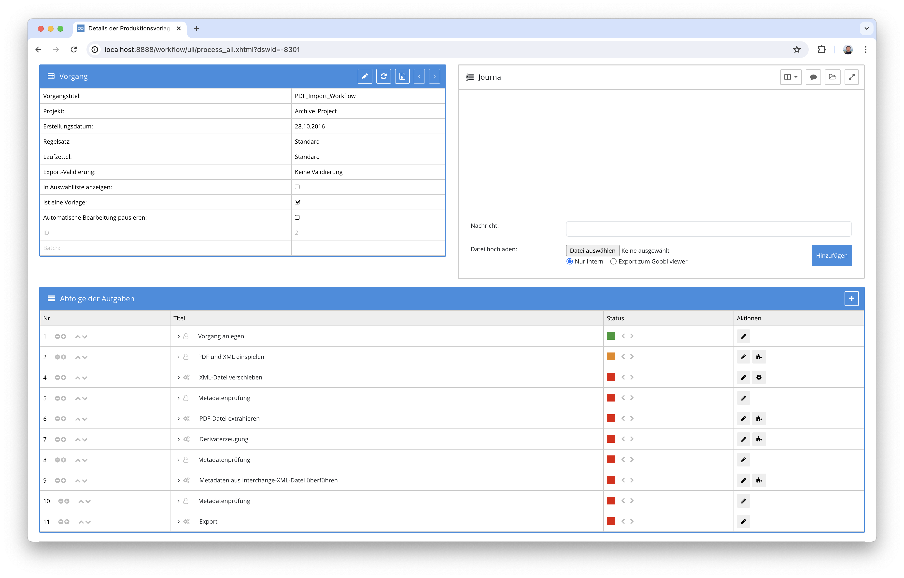
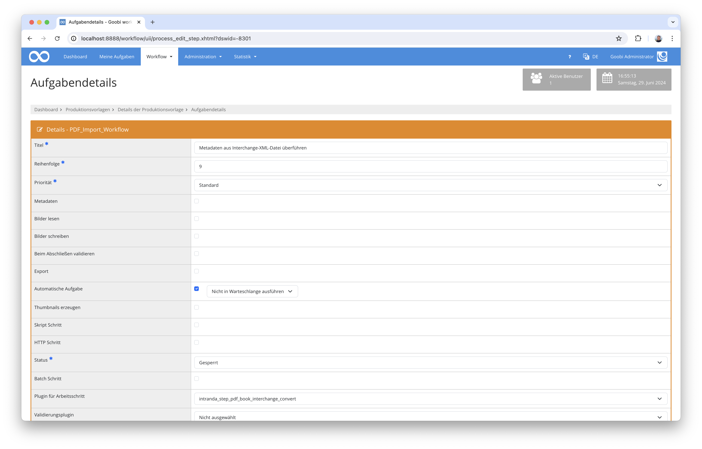

## Einführung
Diese Dokumentation erläutert das Plugin für den Import von Book Interchange Daten im XML-Format zur Anreicherung von Struktur- und Metadaten bestehender Goobi Vorgänge.

## Installation
Um das Plugin nutzen zu können, müssen folgende Dateien installiert werden:

```bash
/opt/digiverso/goobi/plugins/step/plugin-step-pdf-book-interchange-convert-base.jar
/opt/digiverso/goobi/config/plugin_intranda_step_pdf_book_interchange_convert.xml
```

Nach der Installation des Plugins kann dieses innerhalb des Workflows für die jeweiligen Arbeitsschritte ausgewählt und somit automatisch ausgeführt werden. Ein Workflow könnte dabei beispielhaft wie folgt aussehen:



Für die Verwendung des Plugins muss dieses in einem Arbeitsschritt ausgewählt sein:



## Überblick und Funktionsweise
In dem hier gezeigten Workflow wurde zunächst eine PDF-Datei zusammen mit einer Book-Interchange-Datei eingespielt. Die PDF-Datei wurden im Verlauf des Workflows zu Bildern konvertiert, die im `master`-Ordner gespeichert wurden. Die PDF-Datei wurde im Workflow automatisch in den `import`-Ordner verschoben. Die Book-Interchange-Datei wurde in den `source`-Ordner verschoben. Anschließend hat das Book-Interchange-Plugin die bereits vom PDF-Extraction-Plugin erzeugten Strukturdaten, die aus der PDF-Datei gelesen werden konnten, mit den Informationen aus der Book-Interchange-Datei angereichert. 


## Konfiguration
Die Konfiguration des Plugins erfolgt in der Datei `plugin_intranda_step_pdf_book_interchange_convert.xml` wie hier aufgezeigt:

{{CONFIG_CONTENT}}

{{CONFIG_DESCRIPTION_PROJECT_STEP}}


Parameter               | Erläuterung
------------------------|-----------
`structureTypePdf`      | Benennung des Strukturtyps der Elemente, die durch das im Workflow zuvor verwendete Plugin zur PDF-Extraktion erzeugt wurden.
`structureTypeBits`      | Benennung des Strukturtyps für die Elemente, die das Book-Interchange-Plugin erzeugen soll.
`publicationMapping`      | Bereich für die Definition der Publikationsmetadaten, die innerhalb der METS-Datei angereichert werden sollen. Hierbei sind jeweils über eine Kombination die Daten aus der XML-Datei mittels xPath-Ausdrücken und der Metadatentyp aus dem Regelsatz angegeben.
`elementMapping`      | Bereich für die Definition der Strukturdaten, die innerhalb der METS-Datei angereichert oder erzeugt werden sollen. Hierbei sind jeweils über eine Kombination die Daten aus der XML-Datei mittels xPath-Ausdrücken und der Metadatentyp aus dem Regelsatz angegeben.


Für eine einfachere Inbetriebnahme befindet sich in `install`-Ordner des Plugins eine Datei mit dem Namen `ruleset.xml` die als Referenz-Regelsatz zu der hier aufgeführte Konfigurationsdatei passt.
