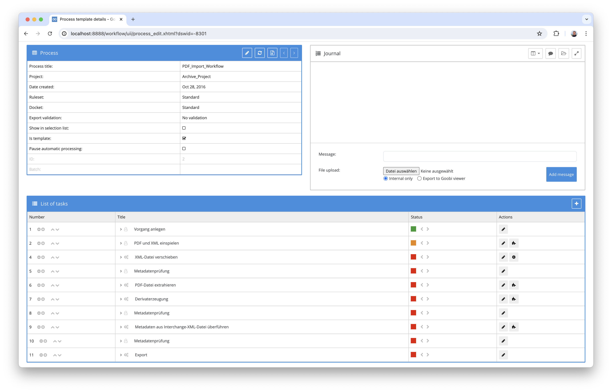
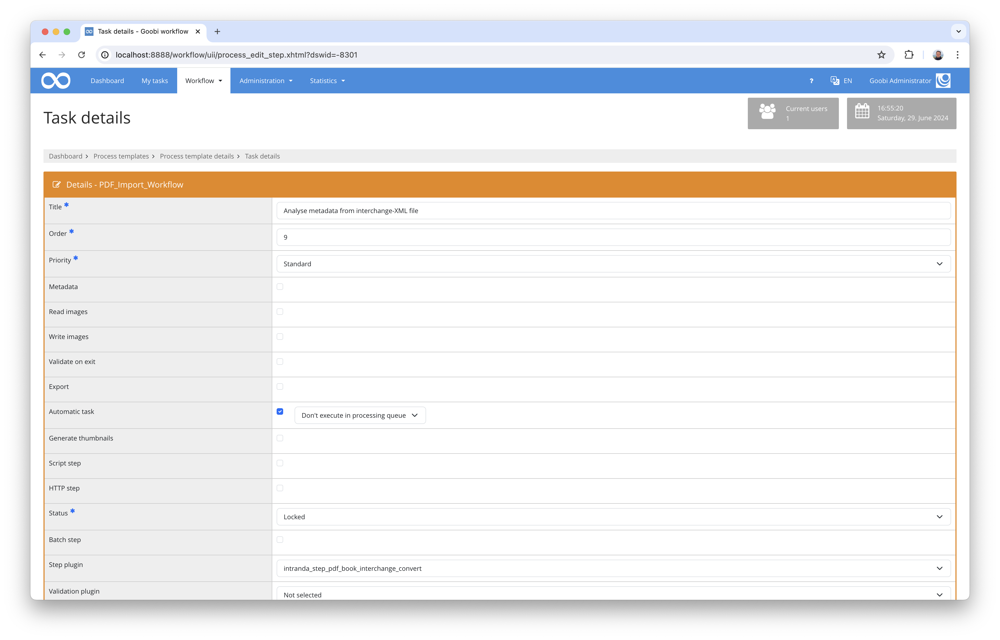

## Introduction
This documentation explains the plugin for importing book interchange data in XML format to enrich the structure and metadata of existing Goobi processes.

## Installation
To be able to use the plugin, the following files must be installed:

```bash
/opt/digiverso/goobi/plugins/step/plugin-step-pdf-book-interchange-convert-base.jar
/opt/digiverso/goobi/config/plugin_intranda_step_pdf_book_interchange_convert.xml
```

Once the plugin has been installed, it can be selected within the workflow for the respective work steps and thus executed automatically. A workflow could look like the following example:



To use the plugin, it must be selected in a workflow step:



## Overview and functionality
In the workflow shown here, a PDF file was first imported together with a book interchange file. The PDF file was converted to images during the workflow, which were saved in the 'master' folder. The PDF file was automatically moved to the 'import' folder in the workflow. The book interchange file was moved to the 'source' folder. The book interchange plugin then enriched the structure data already generated by the PDF extraction plugin, which could be read from the PDF file, with the information from the book interchange file. 


## Configuration
The plugin is configured in the file `plugin_intranda_step_pdf_book_interchange_convert.xml` as shown here:

{{CONFIG_CONTENT}}

{{CONFIG_DESCRIPTION_PROJECT_STEP}}


Parameter               | Explanation
------------------------|-----------
`structureTypePdf`      | Naming of the structure type of the elements that were created by the plugin previously used in the workflow for PDF extraction.
`structureTypeBits`      | Naming of the structure type for the elements that the book interchange plugin is to generate.
`publicationMapping`      | Area for defining the publication metadata to be enriched within the METS file. In each case, the data from the XML file is specified via a combination using xPath expressions and the metadata type from the ruleset.
`elementMapping`      | Area for defining the structural data that is to be enriched or generated within the METS file. In each case, the data from the XML file is specified via a combination using xPath expressions and the metadata type from the rule set.


For easier commissioning, a file with the name `ruleset.xml` can be found in the `install` folder of the plugin, which serves as a reference ruleset for the configuration file listed here.
